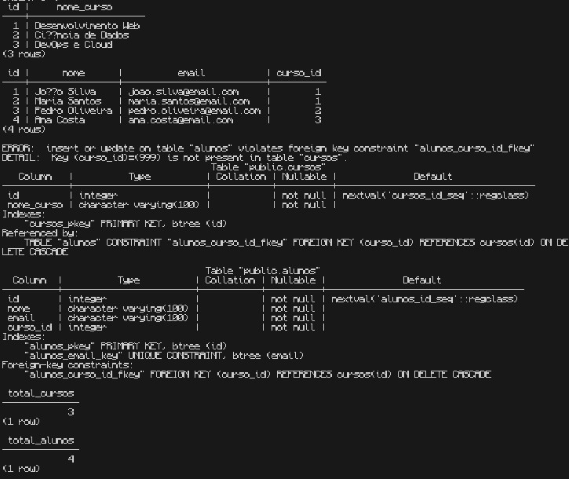
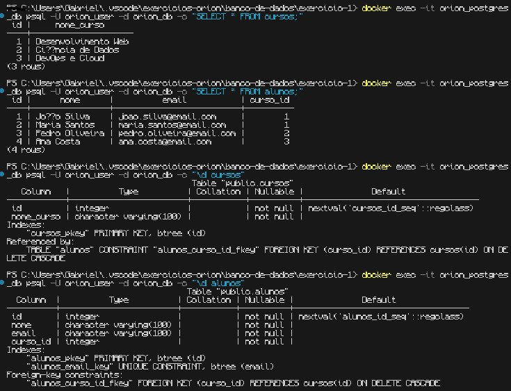

# Exercício 1 - SQL Básico (CREATE TABLE, INSERT, SELECT)

## Objetivo
Aprender os comandos básicos de SQL para Definição (CREATE TABLE) e Manipulação (INSERT, SELECT).

## Tarefas

### 1. Criar tabela de cursos
- Colunas: `id` (PK), `nome_curso`

### 2. Criar tabela de alunos
- Colunas: `id` (PK), `nome`, `email`, `curso_id` (FK)
- `curso_id` referencia `cursos.id`

### 3. Inserir dados
- 2-3 cursos
- 3-4 alunos (relacionados aos cursos)

### 4. Consultar dados
- `SELECT * FROM cursos;`
- `SELECT * FROM alunos;`

## Critérios de Sucesso
- [ ] Tabelas criadas sem erros
- [ ] Chave estrangeira impede inserção de `curso_id` inválido
- [ ] Dados inseridos corretamente
- [ ] SELECT retorna todos os registros

## Como Executar

### Opção 1: Via DBeaver/pgAdmin
1. Conecte ao banco PostgreSQL
   - Host: localhost
   - Porta: 5432
   - Database: orion_db
   - User: orion_user
   - Password: orion_password
2. Abra o arquivo `solucao.sql`
3. Execute os comandos
4. Capture screenshots dos resultados

### Opção 2: Via Terminal

```powershell
# Executar o script
Get-Content solucao.sql | docker exec -i orion_postgres_db psql -U orion_user -d orion_db

# Verificar tabelas criadas
docker exec -it orion_postgres_db psql -U orion_user -d orion_db -c "\dt"

# Ver dados inseridos
docker exec -it orion_postgres_db psql -U orion_user -d orion_db -c "SELECT * FROM cursos;"
docker exec -it orion_postgres_db psql -U orion_user -d orion_db -c "SELECT * FROM alunos;"
```

### Resultados Esperados

**Tabela cursos**: 3 registros
- Desenvolvimento Web
- Ciência de Dados
- DevOps

**Tabela alunos**: 4 registros com foreign key funcionando

### Screenshots




As imagens mostram a criação das tabelas, inserção de dados e validação das foreign keys.

