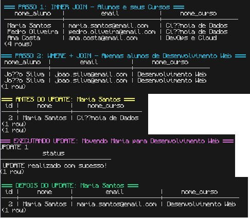

# Exercício 2 - SQL com JOINs e Filtros

## Objetivo
Aprender a consultar dados de múltiplas tabelas usando JOIN e filtrar resultados com WHERE.

## Pré-requisito
Complete o Exercício 1 antes de começar este exercício.

## Tarefas

### 1. INNER JOIN
Escrever um SELECT que mostre o nome do aluno e o nome do curso em uma única consulta.

### 2. WHERE + JOIN
Mostrar apenas os alunos de um curso específico (ex: "Desenvolvimento Web").

### 3. UPDATE
Alterar o `curso_id` de um aluno específico (ex: mover Maria para outro curso).

### 4. Verificar UPDATE
Fazer novo SELECT com JOIN para confirmar a mudança.

### 5. EXTRA (Avançado)
LEFT JOIN + WHERE para descobrir cursos sem alunos.

## Critérios de Sucesso
- [ ] JOIN retorna nomes corretos (aluno + curso)
- [ ] WHERE filtra corretamente
- [ ] UPDATE funciona e é refletido no SELECT
- [ ] Extra: LEFT JOIN identifica cursos vazios

## Como Executar

### Via Terminal

```powershell
# Executar o script completo
Get-Content solucao.sql | docker exec -i orion_postgres_db psql -U orion_user -d orion_db

# Testar INNER JOIN manualmente
docker exec -it orion_postgres_db psql -U orion_user -d orion_db -c "SELECT a.nome AS aluno, c.nome_curso AS curso FROM alunos a INNER JOIN cursos c ON a.curso_id = c.id;"

# Verificar UPDATE
docker exec -it orion_postgres_db psql -U orion_user -d orion_db -c "SELECT a.nome, c.nome_curso FROM alunos a INNER JOIN cursos c ON a.curso_id = c.id WHERE a.nome = 'Maria Santos';"
```

### Via DBeaver/pgAdmin
1. Conecte ao banco PostgreSQL
2. Abra o arquivo `solucao.sql`
3. Execute os comandos um por um
4. Capture screenshots de cada resultado

### Resultados Esperados

**INNER JOIN**: Lista de alunos com seus cursos
**WHERE**: Apenas alunos de um curso específico
**UPDATE**: Maria Santos mudou de curso
**LEFT JOIN**: Mostra cursos sem alunos

### Screenshots




As imagens mostram os resultados dos JOINs, filtros WHERE, UPDATE e LEFT JOIN para encontrar cursos sem alunos.

